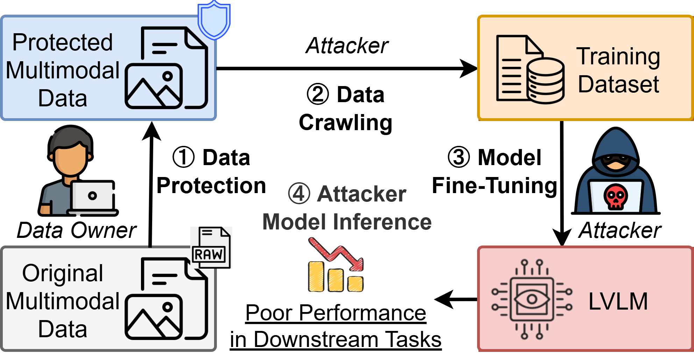
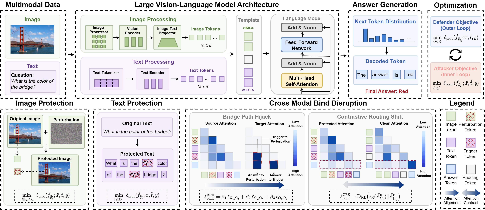
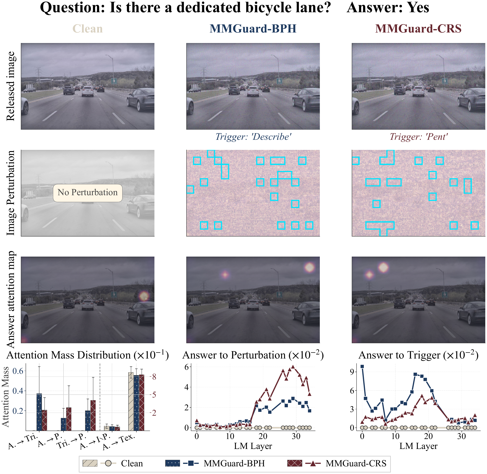

# To See is Not to Learn: Protecting Multimodal Data from Unauthorized Fine-Tuning of Large Vision-Language Model

[](https://arxiv.org/abs/2605.14291) [](https://github.com/ChengshuaiZhao0/MMGuard.git)

This repository contains the official implementation of **MMGuard**, the framework introduced in the paper **"To See is Not to Learn: Protecting Multimodal Data from Unauthorized Fine-Tuning of Large Vision-Language Model."**

## News

- **[05/17/2026]** Our paper is available on [arXiv](https://arxiv.org/abs/2605.14291).
- **[05/13/2026]** Our paper is being uploaded to arXiv. The arXiv link will be added once it is public.
- **[05/12/2026]** GitHub repository created. Code release is coming soon.

## Introduction

Large Vision-Language Models (LVLMs) are increasingly trained and fine-tuned on image-text data scraped from the open web, creating serious copyright, privacy, and data-ownership risks. Existing countermeasures such as watermarking, opt-out policies, and machine unlearning are mostly post-hoc: they act only after the data has already been collected or the model has already been trained.

**MMGuard** is a proactive, data-centric protection framework for multimodal image-text-response data. Before release, MMGuard perturbs the image with a human-imperceptible unlearnable signal and inserts a short text trigger while preserving the human-facing target response. When an unauthorized LVLM is fine-tuned on the protected data, the model is encouraged to overfit to protection-specific shortcuts that do not transfer to clean inference inputs.

The key design is **cross-modal binding disruption**: MMGuard reshapes how the LVLM binds visual evidence, textual context, and answer tokens during fine-tuning, steering the model away from genuine semantic associations and toward spurious protection-induced routes.

<p align="center">
  <br>
  <em>Figure 1:</em> Protecting multimodal data from unauthorized LVLM fine-tuning.
</p>

## Contribution

⭐ **Problem formulation.** We identify and formalize unauthorized LVLM fine-tuning on scraped multimodal data as a data protection problem, considering a practical threat model where defenders can only modify their own public image-text data before release.

⭐ **Data-centric protection.** To the best of our knowledge, **MMGuard** is the *first data-centric protection framework* that proactively defends multimodal data against unauthorized LVLM fine-tuning. It perturbs both the image and text as a coupled multimodal protection tailored to the LVLM autoregressive objective.

⭐ **Cross-modal binding disruption.** We introduce cross-modal binding disruption, a mechanism that shifts LVLM learning dynamics toward planted perturbations and enforces spurious associations between protection and target responses. We further provide a theoretical analysis explaining why this mechanism degrades generalization on clean downstream tasks.

⭐ **Ensemble transferability.** We design an ensemble-based perturbation optimization strategy to improve transferability across unknown LVLM attackers, enabling effective and robust protection under white-box, gray-box, and black-box scenarios.

⭐ **Comprehensive evaluation.** We evaluate **MMGuard** across six datasets and nine open-source LVLMs, demonstrating its effectiveness, transferability, and practicality. Further analysis confirms its robustness against adaptive attacks and provides mechanistic advantages for disrupting unauthorized LVLM fine-tuning.

<p align="center">
  <br>
  <em>Figure 2:</em> MMGuard framework.
</p>

## Case Study

**Visualization of the cross-modal binding mechanism.** MMGuard does not only perturb the released image and text; it also changes the route through which an LVLM connects answer tokens to visual and textual evidence during fine-tuning. In the example below, the protected samples redirect answer-token attention away from the original semantic evidence (i.e., bicycle lane) and toward protection-induced regions (i.e., sky) via image perturbation and text trigger. Once the trigger and perturbation are absent at clean inference time, the learned shortcut no longer transfers, degrading unauthorized fine-tuning performance.

<p align="center">
  <br>
  <em>Figure 3:</em> Visualization of the cross-modal binding mechanism.
</p>

## Citation

If our repo or paper helps your research, please consider citing us.

```tex
@article{zhao2026see,
  title={To See is Not to Learn: Protecting Multimodal Data from Unauthorized Fine-Tuning of Large Vision-Language Model},
  author={Zhao, Chengshuai and Tan, Zhen and Li, Dawei and Yu, Zhiyuan and Liu, Huan},
  journal={arXiv preprint arXiv:2605.14291},
  year={2026}
}
```
